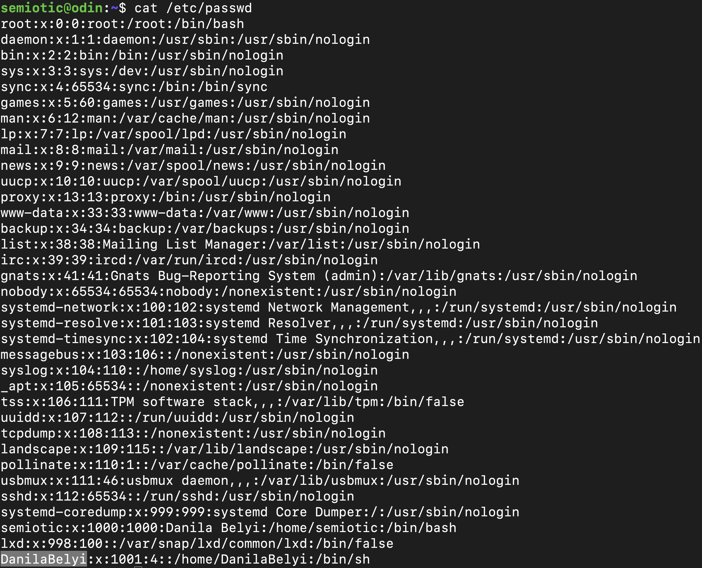
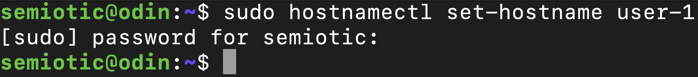

## Part 1. Установка ОС

- 
- Вывод версии Ubuntu командой `cat /etc/issue`

## Part 2. Создание пользователя

- 
- создем нового пользователя командой `sudo useradd -g groupname username`
- 
- вывод созданного пользователя на экран командой `cat /etc/passwd`

## Part 3. Настройка сети ОС

- 
- установка имени машины командой `sudo hostnamectl set-hostname user-1`
- 
- показываем имя машины командой `cat /etc/hostname`
- 
- устанавливаем временную зону командой `sudo timedatectl set-timezone Europe/Moscow`
- 
- проверяем какая временная зона установлена командой `timedatectl`
- 
- выводим названия сетевых интерфейсов с помощью команды `ip -br link show`
- lo - это локальный интерфейс, позволяющий подключаться к самой машине
- 
- получаем IP-адрес от DHCP-сервера командой `sudo dhclient -v enp0s3`
- DHCP - DynamicHost Configuration Protocol (протокол динамической настройки узла)
- 
- проверяем IP шлюза командой `ip route`
- 
- просматриваем внешний IP с помощью команды `wget -qO- eth0.me`
- 
- просматриваем внутренний IP с помощью команды `hostname -I`
- 
- редактируем вручную файл `/etc/netplan/00-installer-config.yaml` задавая статичные IP, GW и DNS и перезагружаем командой `reboot`
- 
- Пингуем удаленные хосты `1.1.1.1` и `ya.ru`  c помощью команды `ping`

## Part 4. Обновление ОС

- 
- обновляем репозитории командой `sudo apt update`
- обновляем систему командой `sudo apt upgrade`
- 
- повторно вводим команду `sudo apt upgrade` чтобы убедиться что система обновилась

## Part 5. Использование команды  sudo

- 
- С помощью команды `usermod -aG sudo DanilaBelyi` разрешаем пользователю выполнять команду `sudo`
- Команда `sudo` позволяет строго определенным пользователям выполнять указанные программы с административными привилегиями без ввода пароля суперпользователя root.

## Part 6. Установка и настройка службы времени

- 
- для синхронизации времени используем команду `sudo timedatectl set-ntp 1`

## Part 7. Установка и использование текстовых редакторов

- 
- с помощью команды `vim test_VIM.txt` создаем и открываем файл, нажимаем «i» чтобы переключиться на режим вставки и записываем свой никнейм, нажимаем «esc» чтобы переключиться на нормальный режим, вводим команду «:wq» для сохранения и выхода, нажимаем «enter»
- 
- с помощью команды `nano test_NANO.txt` создаем и открываем файл, записываем свой никнейм, нажимаем «C-x y» для сохранения и выхода
- 
- с помощью команды `emacs test_EMACS.txt` создаем и открываем файл, записываем свой никнейм, нажимаем «C-X C-c y» для сохранения и выхода

- 
- с помощью команды `vim test_VIM.txt` открываем файл, нажимаем «i» чтобы переключиться на режим вставки и записываем вместо никнейма строку «21 School 21», нажимаем «esc» чтобы переключиться на нормальный режим, вводим команду «:q!» для выхода без сохранения, нажимаем «enter»
- 
- с помощью команды `nano test_NANO.txt` открываем файл, записываем вместо никнейма строку «21 School 21», нажимаем «C-x n» для выхода без сохранения
- 
- с помощью команды `emacs test_EMACS.txt` открываем файл, записываем вместо никнейма строку «21 School 21», нажимаем «C-x C-c y yes» для выхода без сохранения

- 
- с помощью команды `vim test_VIM.txt` открываем файл, нажимаем «/» чтобы начать поиск, после чего вводим подстроку
- 
- с помощью команды `nano test_NANO.txt` открываем файл, нажимаем «C-w» чтобы начать поиск, после чего вводим подстроку и нажимаем «enter»
- 
- с помощью команды `emacs test_EMACS.txt` открываем файл, нажимаем «C-s» чтобы начать поиск, после чего вводим подстроку

- 
- с помощью команды `vim test_VIM.txt` открываем файл, вводим «:s/», вводим подстроку которую хотим заменить, вводим «/», вводим подстроку на которую хотим заменить исходную подстроку, нажимаем «enter»
- 
- с помощью команды `nano test_NANO.txt` открываем файл, нажимаем «C-w C-r», вводим подстроку которую хотим заменить, нажимаем «enter», вводим подстроку на которую хотим заменить исходную подстроку, нажимаем «enter», вводим «y»
- 
- с помощью команды `emacs test_EMACS.txt` открываем файл, нажимаем «M-x» чтобы ввести команду, после чего вводим replace-string и нажимаем «enter». Вводим подстроку которую хотим заменить, нажимаем «enter», вводим подстроку на которую хотим заменить, нажимаем «enter».

## Part 8. Установка и базовая настройка сервиса SSHD

- устанавливаем службу SSHd при помощи командыы `sudo apt install openssh-server`
- добавляем автостарт службы при запуске системы командой `sudo upate-rc.d ssh defaults`
- включаем службу командой `sudo systemctl enable ssh`
- стартуем службу командой `sudo systemctl start ssh`
- изменяем порт вручную командой `sudo vim /etc/ssh/sshd_config`
- смотрим информацию о процессе sshd командой `ps -FC sshd`. Флаг F выдает подробную информацию, флаг С выдает информацию по дочерним процессам
- перезапускаем службу командой `sudo systemctl restart sshd.service`
- 
- результат команды `netstat -tan`
- флаг t - вывод TCP соединений; флаг а - вывод прослушиваемых и непрослушиваемых сокетов; флаг n - вывод в цифрах адреса, порта и имени пользователей
- колонка Proto выводит протоколы, используемые сокетом; колонка Recv-Q выводит нескопированные пользовательской программой байты из сокета; колонка Send-Q выводит не подтвержденные сокетом байты; колонка Local Address выводит адрес и номер порта локального сокета; колонка Foreign Address выводит адрес и номер порта удаленного сокета; колонка State выводит состояние сокета; 0.0.0.0 означает неопределенный адрес (любой).

## Part 9. Установка и использование утилит top, htop

- 
- uptime 28 минут
- количество авторизованных пользователей 1
- общая загрузка системы 0.06, 0.01, 0.00
- общее количество процессов 98
- загрузка CPU 0.00
- загрузка памяти 168.8
- pid процесса, занимающего больше всего памяти 1
- pid процесса, занимающего больше всего процессорного времени 1
- 
- сортировка по PID
- 
- сортировка по Percent_CPU
- 
- сортировка по Percent MEM
- 
- сортировака по TIME
- 
- фильтр по sshd
- 
- процесс syslog, найденный через поиск
- 
- вывод hostname, clock и uptime

## Part 10. Использование утилиты fdisk

- 
- название жесткого диска VBOX HARDDISK
- размер 10 Gib, 10737418240 bytes
- 20971520 секторов
- размер swap 0

## Part 11. Использование утилиты df

- 
- размер раздела 8408452 Килобайт
- размер занятого пространства 4542512 Килобайт
- размер свободного пространства 3417224 Килобайт
- процент использования 58
- 
- размер раздела 8.1 Гигабайт
- размер занятого пространства 4.4 Гигабайт
- размер свободного пространства 3.3 Гигабайт
- процент использования 58
- тип файловой системы для раздела ext4

## Part 12. Использование утилиты du

- 
- флаг `h` для вывода в человеческом стиле
- флаг `B` для вывода в нужном размере, далее размер
- флаг `s` для вывода именно указанных далее директорий
- 
- флаг `аll` для вывода всех файлов, а не только директорий

## Part 13. Установка и использование утилиты ncdu

- 
- 
- 
- делаем вывод команды `ncdu [dirname]`, в данном случае `/home`, `/var`, `/var/log`.

## Part 14. Работа с системными журналами

- 
- Время последней авторизации 14:58:29, имя пользователя semiotic
- 
- Рестарт службы

## Part 15. Использование планировщика заданий CRON

- crontab -e (редактировать файл)
- crontab -l (показать список задач)
- 
- запускаем команду uptime через каждые 2 минуты при помощи команды `*/2 * * * * uptime`
- 
- 