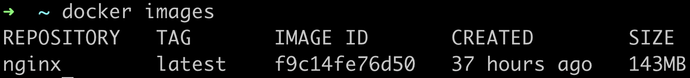

# DO5_SimpleDocker

## Part 1. Готовый докер

- Взять официальный докер образ с **nginx** и выкачать его при помощи `docker pull`
  
 

- Проверить наличие докер образа через `docker images`

 

- Запустить докер образ через `docker run -d [image_id|repository]`

 

- Проверить, что образ запустился через `docker ps`

 

- Посмотреть информацию о контейнере через `docker inspect [container_id|container_name]`

 

- Размер контейнера. Значение 67108864 представляет собой размер сегмента общей памяти в байтах, что составляет 64 мегабайта. Это означает, что контейнер настроен так, чтобы его процессы могли использовать 64 МБ общей памяти для межпроцессного взаимодействия.

- Список замапленных портов

- IP контейнера

- Остановить докер образ через `docker stop [container_id|container_name]`

- Проверить, что образ остановился через `docker ps`

- Запустить докер с замапленными портами 80 и 443 на локальную машину через команду *run*

- Проверить, что в браузере по адресу *localhost:80* доступна стартовая страница **nginx**

- Перезапустить докер контейнер через `docker restart [container_id|container_name]`

- Проверить любым способом, что контейнер запустился

## Part 2. Операции с контейнером

- Прочитать конфигурационный файл *nginx.conf* внутри докер контейнера через команду *exec*

  
- Создать на локальной машине файл *nginx.conf.* Настроить в нем по пути */status* отдачу страницы статуса сервера nginx

- Скопировать созданный файл *nginx.conf* внутрь докер образа через команду `docker cp`

- Содержимое файла

- Перезапустить nginx внутри докер образа через команду *exec*

- Проверить, что по адресу *localhost:80/status* отдается страничка со статусом сервера nginx

- Экспортировать контейнер в файл *container.tar* через команду *export.* Остановить контейнер. Удалить образ через `docker rmi [image_id|repository]`, не удаляя перед этим контейнеры. Удалить остановленный контейнер.

- Импортировать контейнер обратно через команду *import.* Запустить импортированный контейнер]

- Импорт контейнера

- Проверить, что по адресу *localhost:80/status* отдается страничка со статусом сервера nginx

## Part 4. Свой докер

- Все также работает

- Отображение статуса

## Part 5. Dockle

- Ошибок и предупреждений нет

## Part 6. Базовый Docker Compose

- Цепочка контейнеров также поднимает nginx

